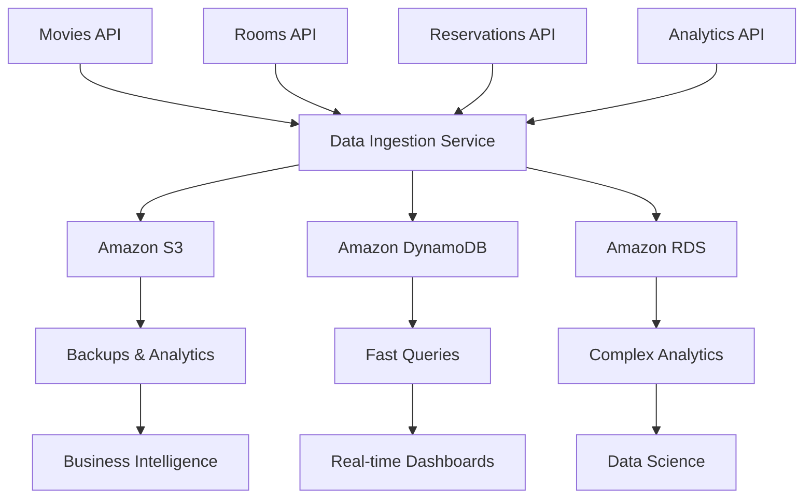

# Sistema de Microservicios para Cine

Sistema completo de microservicios para gestión de un cine, implementado con diferentes tecnologías y bases de datos según los requerimientos.

## Arquitectura

### Microservicios

1. **Movies API** (Next.js + MongoDB)
   - Puerto: 3001
   - Gestión de películas y géneros
   - Base de datos: MongoDB

2. **Rooms API** (Python + MySQL)
   - Puerto: 3002
   - Gestión de salas, asientos y horarios
   - Base de datos: MySQL

3. **Reservations API** (Java + PostgreSQL)
   - Puerto: 3003
   - Gestión de reservas, usuarios y pagos
   - Base de datos: PostgreSQL

4. **Gateway API** (Node.js)
   - Puerto: 3004
   - Orquestador que consume otros microservicios
   - Endpoints unificados

5. **Analytics API** (Node.js)
   - Puerto: 3005
   - Análisis de datos y métricas
   - Reportes y estadísticas

6. **Data Ingestion Service** (Python + AWS) 🆕
   - Puerto: 3006
   - Migración y sincronización de datos a AWS
   - Servicios: S3, DynamoDB, RDS

## Bases de Datos

### MongoDB (Movies API)
- **Base de datos**: `cinema_movies`
- **Colecciones**: `movies`, `genres`
- **Documentos**: Estructura JSON para películas y géneros

### MySQL (Rooms API)
- **Base de datos**: `cinema_rooms`
- **Tablas**: `rooms`, `seats`, `schedules`
- **Relaciones**: 1:N entre rooms-seats y rooms-schedules

### PostgreSQL (Reservations API)
- **Base de datos**: `cinema_reservations`
- **Tablas**: `users`, `reservations`, `reserved_seats`, `payments`
- **Relaciones**: 1:N entre users-reservations, reservations-reserved_seats, 1:1 entre reservations-payments

### AWS Services (Data Ingestion) 🆕
- **S3**: Backups y almacenamiento de datos históricos
- **DynamoDB**: Base de datos NoSQL para consultas rápidas
- **RDS**: Data warehouse para analytics (opcional)

## Instalación y Ejecución

### Opción 1: Docker Compose (Recomendado)

```bash
# Clonar el repositorio
git clone <repository-url>
cd all-cloud-back-apis

# Configurar variables de entorno para AWS
cp env.docker.example .env.docker
# Editar .env.docker con tus credenciales AWS

# Ejecutar todos los servicios
docker-compose up -d

# Ver logs
docker-compose logs -f

# Detener servicios
docker-compose down
```

### Opción 2: Ejecución Manual

#### Prerrequisitos
- Node.js 18+
- Python 3.11+
- Java 17+
- MongoDB
- MySQL 8.0+
- PostgreSQL 15+
- Redis (para Data Ingestion Service)

#### Movies API
```bash
cd movies-api
npm install
cp .env.example .env
# Configurar MONGODB_URI en .env
npm run dev
```

#### Rooms API
```bash
cd rooms-api
pip install -r requirements.txt
cp .env.example .env
# Configurar variables de MySQL en .env
python app.py
```

#### Reservations API
```bash
cd reservations-api
mvn clean install
# Configurar variables de PostgreSQL en application.yml
mvn spring-boot:run
```

#### Gateway API
```bash
cd gateway-api
npm install
cp .env.example .env
# Configurar URLs de otros servicios en .env
npm run dev
```

#### Analytics API
```bash
cd analytics-api
npm install
cp .env.example .env
# Configurar URLs de otros servicios en .env
npm run dev
```

#### Data Ingestion Service 🆕
```bash
cd data-ingestion-service
pip install -r requirements.txt
cp env.example .env
# Configurar credenciales AWS en .env
python main.py --mode api --port 3006
```

## Endpoints Principales

### Movies API (http://localhost:3001)
- `GET /api/movies` - Listar películas
- `GET /api/movies/:id` - Obtener película
- `POST /api/movies` - Crear película
- `GET /api/movies/search?q=termino` - Buscar películas
- `GET /api/movies/featured` - Películas destacadas

### Rooms API (http://localhost:3002)
- `GET /api/rooms` - Listar salas
- `GET /api/rooms/:id/seats` - Asientos de sala
- `GET /api/schedules` - Listar horarios
- `POST /api/schedules` - Crear horario

### Reservations API (http://localhost:3003)
- `GET /api/users` - Listar usuarios
- `POST /api/users` - Crear usuario
- `GET /api/reservations` - Listar reservas
- `POST /api/reservations` - Crear reserva
- `POST /api/payments` - Procesar pago

### Gateway API (http://localhost:3004)
- `GET /api/showtimes` - Horarios completos
- `POST /api/book-ticket` - Reservar ticket
- `GET /api/user-dashboard/:userId` - Dashboard usuario
- `GET /api/movie-details/:movieId` - Detalles película

### Analytics API (http://localhost:3005)
- `GET /api/analytics/revenue` - Análisis ingresos
- `GET /api/analytics/popular-movies` - Películas populares
- `GET /api/analytics/occupancy` - Ocupación salas
- `GET /api/analytics/user-behavior` - Comportamiento usuarios
- `GET /api/analytics/dashboard` - Dashboard general

### Data Ingestion Service (http://localhost:3006) 🆕
- `GET /health` - Estado del servicio
- `POST /migrate` - Migración completa a AWS
- `POST /backup` - Backup manual a S3
- `POST /sync/{table_name}` - Sincronización incremental
- `GET /backups` - Listar backups disponibles
- `GET /dynamodb/tables` - Listar tablas DynamoDB
- `GET /dynamodb/{table_name}/items` - Obtener items DynamoDB

## Estructura del Proyecto

```
all-cloud-back-apis/
├── movies-api/                 # Next.js + MongoDB
├── rooms-api/                  # Python + MySQL
├── reservations-api/           # Java + PostgreSQL
├── gateway-api/                # Node.js Gateway
├── analytics-api/              # Node.js Analytics
├── data-ingestion-service/     # Python + AWS 🆕
├── database-designs/           # Esquemas de BD
├── docker-compose.yml          # Orquestación Docker
├── env.docker.example          # Variables de entorno AWS
└── README.md                   # Este archivo
```

## Características Técnicas

### Cumplimiento de Requerimientos
- ✅ 3 microservicios con bases de datos propias
- ✅ 3 lenguajes de programación diferentes
- ✅ 3 bases de datos diferentes (2 SQL + 1 NoSQL)
- ✅ Al menos 2 tablas relacionadas en cada BD SQL
- ✅ Comunicación entre microservicios
- ✅ Documentación de estructuras de BD
- ✅ **Integración con servicios de AWS** 🆕

### Tecnologías Utilizadas
- **Frontend/API**: Next.js, Python Flask, Java Spring Boot, Node.js
- **Bases de Datos**: MongoDB, MySQL, PostgreSQL
- **AWS Services**: S3, DynamoDB, RDS 🆕
- **Contenedores**: Docker, Docker Compose
- **Comunicación**: HTTP REST APIs
- **Orquestación**: Docker Compose

### Patrones Implementados
- **Microservicios**: Separación de responsabilidades
- **API Gateway**: Punto de entrada unificado
- **Event Sourcing**: Comunicación asíncrona
- **CQRS**: Separación de comandos y consultas
- **Circuit Breaker**: Manejo de fallos
- **Data Lake**: Almacenamiento en AWS S3 🆕
- **NoSQL**: Consultas rápidas con DynamoDB 🆕

## Configuración AWS 🆕

### Servicios Utilizados

#### Amazon S3
- **Bucket**: `cinema-data-bucket`
- **Estructura**: `backups/`, `analytics/`
- **Encriptación**: AES-256

#### Amazon DynamoDB
- **Tablas**:
  - `cinema-movies`: Películas
  - `cinema-rooms`: Salas
  - `cinema-reservations`: Reservas
  - `cinema-users`: Usuarios
- **Índices**: Por género, tipo de pantalla, usuario, película

#### Amazon RDS (Opcional)
- **Motor**: PostgreSQL
- **Propósito**: Analytics avanzados

### Configuración Inicial

```bash
# 1. Configurar credenciales AWS
export AWS_ACCESS_KEY_ID=your_key
export AWS_SECRET_ACCESS_KEY=your_secret
export AWS_REGION=us-east-1

# 2. Configurar recursos AWS
cd data-ingestion-service
python scripts/setup_aws_resources.py

# 3. Ejecutar migración inicial
python main.py --mode migrate
```

### Migración de Datos

```bash
# Migración completa
curl -X POST http://localhost:3006/migrate

# Backup manual
curl -X POST http://localhost:3006/backup

# Sincronización incremental
curl -X POST http://localhost:3006/sync/rooms
```

## Monitoreo y Logs

```bash
# Ver logs de todos los servicios
docker-compose logs -f

# Ver logs de un servicio específico
docker-compose logs -f data-ingestion-service

# Ver estado de los servicios
docker-compose ps

# Health check del servicio de ingesta
curl http://localhost:3006/health
```

## Despliegue en AWS

Para desplegar en AWS, cada microservicio puede ser containerizado y desplegado en:

### Opción 1: AWS ECS + Fargate
- **Contenedores**: ECS para orquestación
- **Bases de datos**: RDS para SQL, DocumentDB para MongoDB
- **Almacenamiento**: S3 para backups
- **NoSQL**: DynamoDB para consultas rápidas

### Opción 2: AWS EKS
- **Kubernetes**: EKS para orquestación
- **Ingress**: Application Load Balancer
- **Monitoring**: CloudWatch y X-Ray

### Opción 3: Serverless (AWS Lambda)
- **API Gateway**: Endpoints REST
- **Lambda**: Funciones serverless
- **DynamoDB**: Base de datos serverless
- **S3**: Almacenamiento serverless

## Flujo de Datos 🆕



## Contribución

1. Fork el proyecto
2. Crea una rama para tu feature (`git checkout -b feature/AmazingFeature`)
3. Commit tus cambios (`git commit -m 'Add some AmazingFeature'`)
4. Push a la rama (`git push origin feature/AmazingFeature`)
5. Abre un Pull Request

## Licencia

Este proyecto está bajo la Licencia MIT - ver el archivo [LICENSE](LICENSE) para detalles.